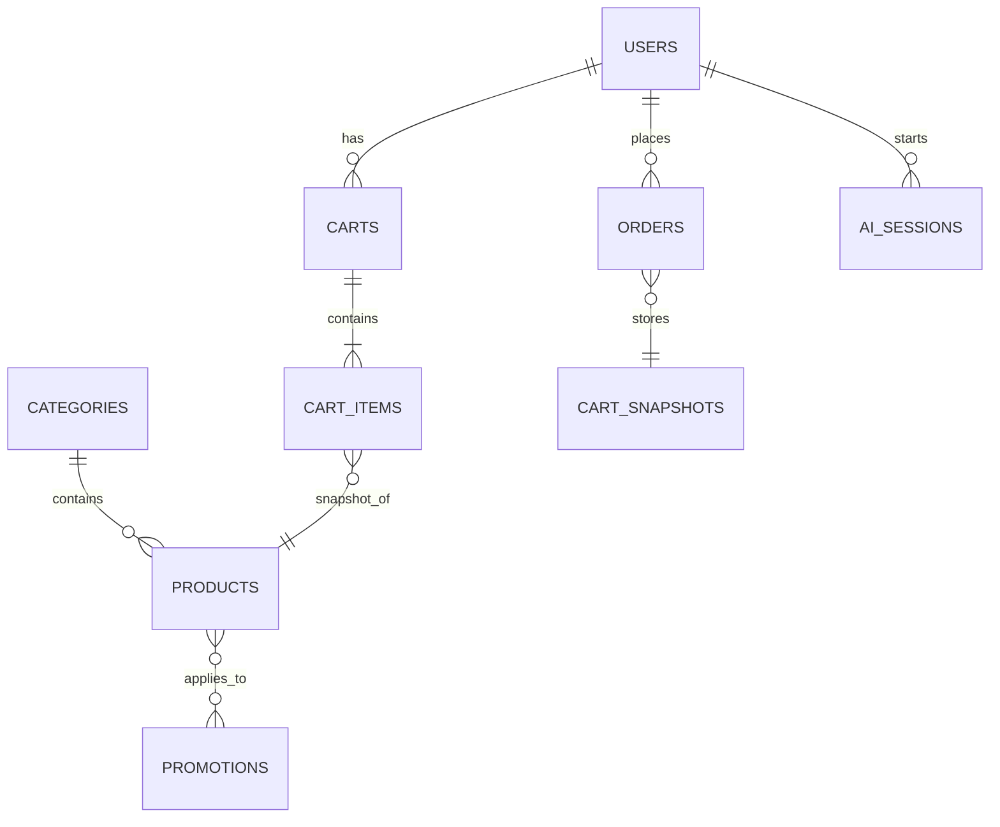

# 📊 FastSpot — Database Overview

A concise reference for FastSpot's main collections, key fields, and relationships.

## Diagram (ER)

Mermaid ER diagram (preferred renderers will show this visually):



Plain-text fallback:

Users 1→N Carts, Orders, AI_Sessions
Categories 1→N Products
Products N↔M Promotions
Carts → CartItems → Product snapshots
Orders → CartSnapshot

## Summary
Main collections: users, categories, products, carts, orders, promotions, mood_questions, mood_rules, ai_sessions.

## Collections (short)
- users — Admin & guest accounts (role, email, passwordHash, phone, createdAt)
- categories — Menu sections (name, slug, isActive)
- products — Menu items (name, slug, priceUSD, categoryId, tags, isActive)
- carts — Active carts (userId or sessionId, items[], totalUSD, updatedAt)
- orders — Completed purchases (userId, cartSnapshot, status, payment, delivery, totalUSD, createdAt)
- promotions — Deals (title, startsAt, endsAt, appliesTo[], isActive)
- mood_questions / mood_rules — Quiz + rule-based recommendations
- ai_sessions — AI history (userId, sessionId, answers, aiResponse, fallbackUsed, createdAt)

## Key relationships
- users 1→N carts, orders, ai_sessions
- categories 1→N products
- products N↔M promotions
- carts contain product snapshots; orders store cartSnapshot

## Typical flow
1. Browse products (filtered by category)
2. Add product → cart (userId or sessionId)
3. Checkout → create order with cartSnapshot
4. Optionally: take mood quiz → ai_sessions → recommended products

## Example queries (MongoDB)
Find burgers under $7:
```javascript
db.products.find({ categoryId: burgersCategory._id, priceUSD: { $lt: 7 }, isActive: true }).sort({ priceUSD: 1 })
```

Create order from cart (conceptual):
```javascript
const cart = await db.carts.findOne({ userId })
await db.orders.insertOne({ userId, cartSnapshot: cart, status: 'pending', totalUSD: cart.totalUSD, createdAt: new Date() })
await db.carts.updateOne({ userId }, { $set: { items: [], totalUSD: 0 } })
```

## Index recommendations (critical)
- users.email (unique)
- products.slug, products.categoryId, products.tags
- carts.userId, carts.sessionId
- orders.createdAt (desc), orders.status

A compact map to help navigate FastSpot's schema and common operations.
