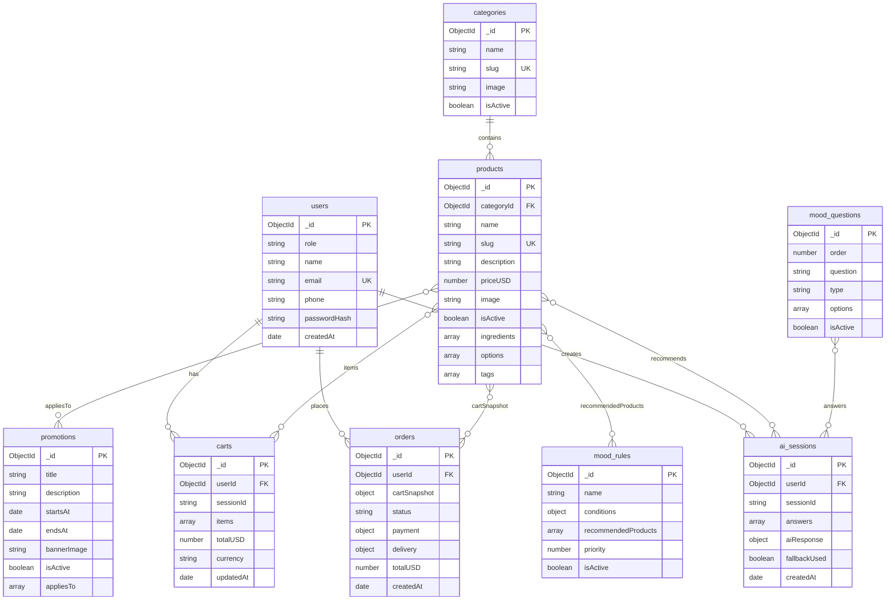
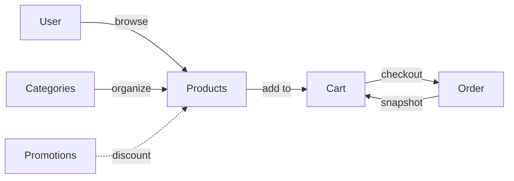
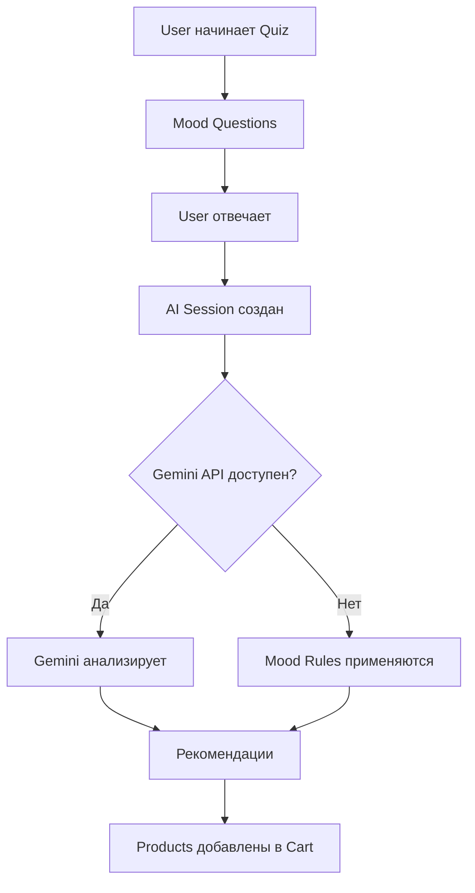
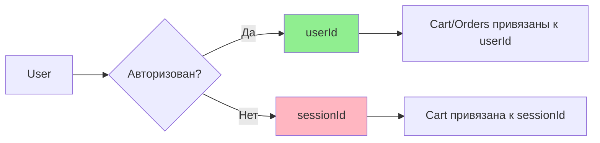
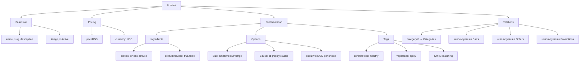

# 📊 Диаграмма структуры базы данных FastSpot

## Общая схема связей



---

## Основные потоки данных

### 1. 🛒 Процесс заказа



### 2. 🤖 AI-рекомендации



### 3. 👤 Типы пользователей



---

## Детальная структура коллекций

### Products - самая сложная структура



### Cart Items - структура элемента корзины

```json
{
  "items": [
    {
      "productId": "ObjectId",
      "qty": 2,
      "chosenIngredients": ["pickles", "onions"],
      "chosenOptions": {
        "size": "large",
        "sauce": "bbq"
      },
      "unitPriceUSD": 7.99,
      "totalUSD": 15.98
    }
  ],
  "totalUSD": 15.98
}
```

### Order - полная информация

```json
{
  "cartSnapshot": { /* копия cart */ },
  "status": "preparing",
  "payment": {
    "method": "card",
    "status": "paid"
  },
  "delivery": {
    "type": "courier",
    "address": "123 Main St",
    "eta": "2024-01-15T18:30:00Z",
    "tracking": [
      {
        "ts": "2024-01-15T17:00:00Z",
        "status": "preparing",
        "note": "Ваш заказ готовится"
      }
    ]
  }
}
```

---

## Индексы для производительности

### Критические индексы

| Коллекция | Поле | Тип | Цель |
|-----------|------|-----|------|
| **users** | email | unique | Быстрый поиск по email |
| **categories** | slug | unique | URL-friendly поиск |
| **products** | slug | unique | URL-friendly поиск |
| **products** | categoryId | index | Фильтр по категории |
| **products** | tags | index | AI matching |
| **carts** | userId | index | Поиск корзины пользователя |
| **carts** | sessionId | index | Гостевые корзины |
| **orders** | createdAt | index (desc) | Сортировка новых заказов |
| **orders** | status | index | Фильтр по статусу |

---

## Примеры запросов

### Найти все бургеры дешевле $7

```javascript
db.products.find({
  categoryId: burgersCategory._id,
  priceUSD: { $lt: 7 },
  isActive: true
}).sort({ priceUSD: 1 })
```

### Найти продукты для "комфортной еды"

```javascript
db.products.find({
  tags: { $in: ["comfort-food", "indulgent"] },
  isActive: true
})
```

### Создать заказ из корзины

```javascript
// 1. Получить корзину
const cart = await db.carts.findOne({ userId: userId })

// 2. Создать заказ
await db.orders.insertOne({
  userId: userId,
  cartSnapshot: {
    items: cart.items,
    totalUSD: cart.totalUSD
  },
  status: "pending",
  payment: { method: "card", status: "pending" },
  delivery: { type: "pickup", tracking: [] },
  totalUSD: cart.totalUSD,
  createdAt: new Date()
})

// 3. Очистить корзину
await db.carts.updateOne(
  { userId: userId },
  { $set: { items: [], totalUSD: 0 } }
)
```

### AI-рекомендации с fallback

```javascript
// 1. Создать AI сессию
const session = await db.ai_sessions.insertOne({
  userId: userId,
  sessionId: sessionId,
  answers: userAnswers,
  createdAt: new Date()
})

// 2. Попытка получить рекомендации от Gemini
try {
  const aiResponse = await callGeminiAPI(userAnswers)
  await db.ai_sessions.updateOne(
    { _id: session.insertedId },
    { 
      $set: { 
        aiResponse: aiResponse,
        fallbackUsed: false 
      } 
    }
  )
} catch (error) {
  // 3. Fallback на правила
  const rules = await db.mood_rules
    .find({ isActive: true })
    .sort({ priority: -1 })
    .toArray()
  
  const matchedProducts = matchRulesToAnswers(rules, userAnswers)
  
  await db.ai_sessions.updateOne(
    { _id: session.insertedId },
    { 
      $set: { 
        aiResponse: { recommendedProducts: matchedProducts },
        fallbackUsed: true 
      } 
    }
  )
}
```

---

## Масштабирование

### Шардинг (для больших нагрузок)

Рекомендуемые ключи шардинга:

- **orders**: `userId` + `createdAt`
- **carts**: `userId` или `sessionId`
- **ai_sessions**: `userId` + `createdAt`

### Репликация

Для высокой доступности используйте MongoDB Replica Set:

```
Primary (Write) ← → Secondary (Read)
                ← → Secondary (Read)
```

---

**Эта диаграмма помогает визуализировать всю архитектуру базы данных FastSpot! 🎨**

